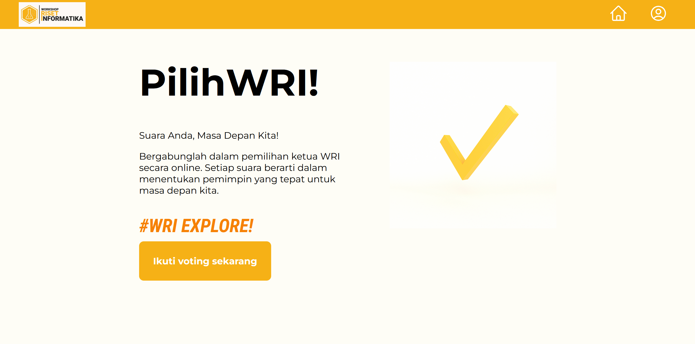

# Bagaimana menjalankan proyek website ini?
1. Kloning repository
    ```bash
    git clone https://github.com/FarrelAD/Kuliah-Web-Basic.git
    ```
2. Pindah direktori ke `09-UTS/`
    ```bash
    cd 09-UTS
    ```
3. Jalankan command berikut
    ```bash
    php -S localhost:8000
    ```
    > ⚠️ Pastikan port yang digunakan belum dipakai oleh proses yang lain

    <details>
        <summary>Command PHP bermasalah ?</summary>
        <p>Masalah ini dikarenakan command PHP masih belum dikenali oleh sistem operasi. Pastikan bahwa anda sudah menambahkan path bin PHP ke dalam environment variable komputer anda.</p>
        <p>Jika menggunakan Laragon:</p>
        <p>Direktori bin PHP di Laragon biasa ditemukan di path:</p>
        <code><parent-directory>\laragon\bin\php\php-<version>-Win32-vs16-x64</code>
        <p>Jika menggunakan XAMPP:</p>
        <p>Direktori bin PHP di Laragon biasa ditemukan di path:</p>
        <code><parent-directory>\xampp\php</code>
    </details>

5. Buka browser pada URL `http://localhost:8000`

    Jika melihat halaman website seperti gambar di atas, maka sudah dipastikan program berhasil. Jika tidak, maka ulangi proses di atas dan pastikan tidak ada yang terlewat.
